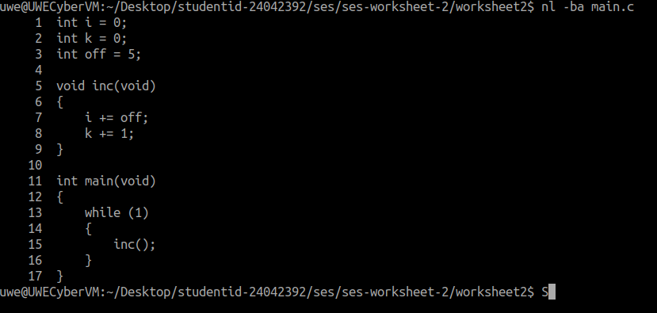
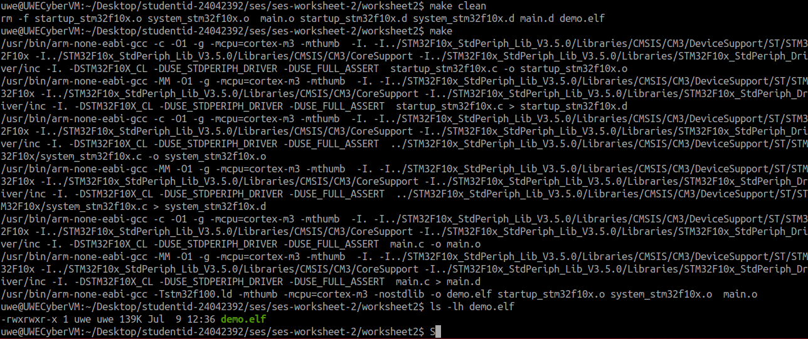
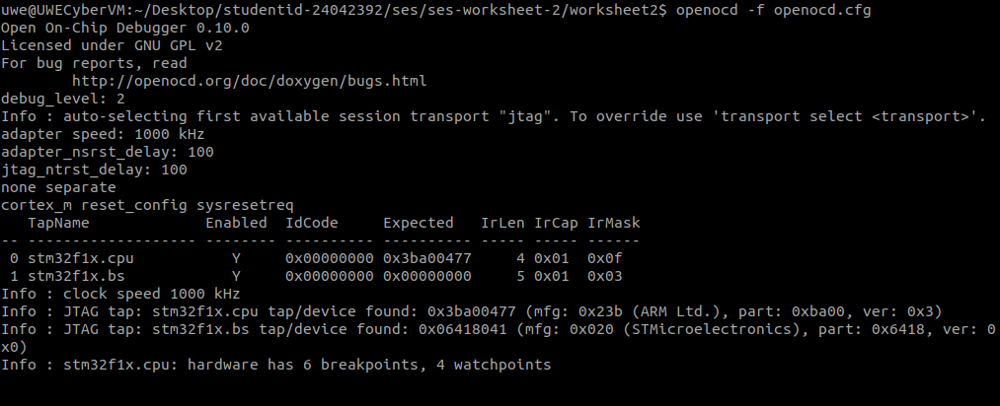
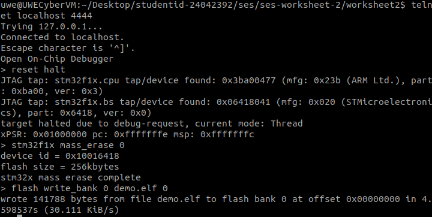
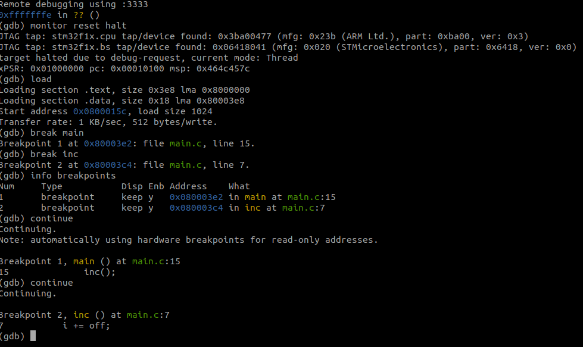
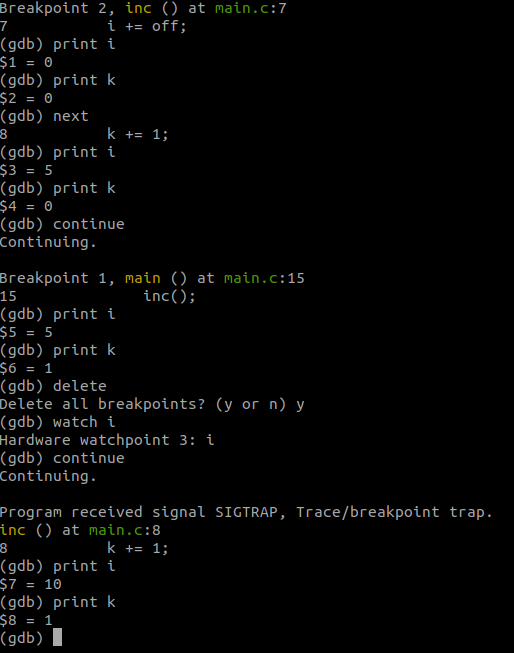
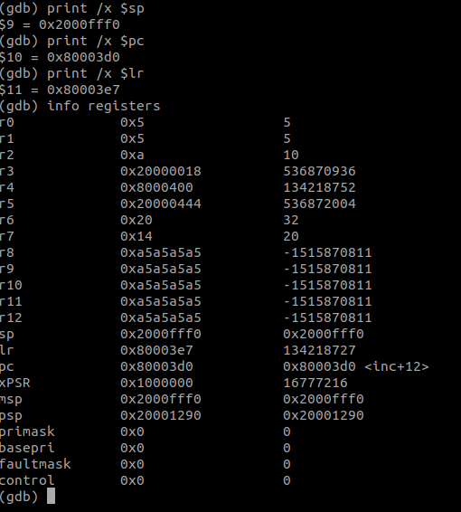
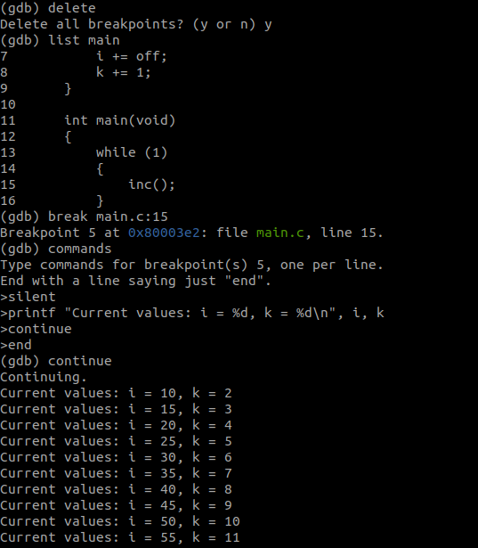

# Secure Embedded Systems – Worksheet 2
## Exploring the ARM Cortex-M3

**Student ID:** 24042392  
**Module:** Secure Embedded Systems  
**Worksheet:** Worksheet 2 – Exploring the ARM Cortex-M3  

---

## Overview

This repository contains my practical work for **Secure Embedded Systems Worksheet 2**, focused on exploring the ARM Cortex-M3 processor and using an STM32F107 development board.

The work undertaken included:

- modifying an embedded C program;
- adding and monitoring a second variable;
- compiling the program using the ARM cross-compilation toolchain;
- connecting to the STM32 board using OpenOCD and JTAG;
- flashing the compiled program to the microcontroller;
- debugging the program using GDB;
- creating breakpoints;
- inspecting variable values;
- creating a hardware watchpoint;
- inspecting ARM Cortex-M3 processor registers;
- creating an automatic breakpoint command that prints variable values and continues execution.

The practical tasks undertaken were completed successfully, and screenshot evidence is included throughout this README and in the `evidence/` directory.

---

## Hardware and Software Used

### Hardware

- STM32 development board using an **STM32F107 ARM Cortex-M3** microcontroller.
- Olimex **ARM-USB-TINY-H** JTAG debugger/programmer.

### Software and Tools

- Linux virtual machine.
- GNU ARM Embedded Toolchain.
- `arm-none-eabi-gcc`.
- GNU Make.
- OpenOCD.
- Telnet.
- GDB Multiarch.

---

## 1. Source Code Modification

The original program used a global variable named `i`, which was incremented using the value stored in `off`.

I modified `main.c` by adding another global variable named `k`.

The completed code was:

```c
int i = 0;
int k = 0;
int off = 5;

void inc(void)
{
    i += off;
    k += 1;
}

int main(void)
{
    while (1)
    {
        inc();
    }
}
```

The `inc()` function now changes both variables:

- `i` increases by `5` every time `inc()` is called.
- `k` increases by `1` every time `inc()` is called.

This allowed both variables to be monitored during debugging and made their different rates of change clearly visible.

### Evidence



---

## 2. Building the Program

Before compiling the modified application, I removed the existing object files and executable using:

```bash
make clean
```

I then rebuilt the application using:

```bash
make
```

The ARM cross-compiler compiled the source code using options including:

```text
-mcpu=cortex-m3
-mthumb
-g
-O1
```

The compilation completed successfully and generated:

```text
demo.elf
```

I confirmed that the executable had been created using:

```bash
ls -lh demo.elf
```

The successful creation of `demo.elf` confirmed that the modified C source code compiled correctly for the ARM Cortex-M3 target.

### Evidence



---

## 3. Connecting to the STM32 Board with OpenOCD

I started OpenOCD using:

```bash
openocd -f openocd.cfg
```

OpenOCD successfully detected the JTAG interface and identified the STM32 JTAG TAP devices:

```text
stm32f1x.cpu
stm32f1x.bs
```

The output also confirmed that the processor hardware supports:

```text
6 breakpoints
4 watchpoints
```

This confirmed that communication between the Linux virtual machine, the Olimex JTAG interface and the STM32 board was working correctly.

### Evidence



---

## 4. Flashing the Program to the STM32 Board

With OpenOCD running, I connected to its command interface using:

```bash
telnet localhost 4444
```

I first reset and halted the STM32 target:

```text
reset halt
```

The target was successfully detected and placed into a halted debug state.

I then erased the flash memory using:

```text
stm32f1x mass_erase 0
```

OpenOCD confirmed:

```text
stm32x mass erase complete
```

I then wrote the compiled executable to the STM32 flash memory using:

```text
flash write_bank 0 demo.elf 0
```

The output confirmed that `demo.elf` was successfully written to flash bank 0.

### Evidence



---

## 5. Debugging with GDB

I started GDB using:

```bash
gdb-multiarch demo.elf
```

I connected GDB to the OpenOCD GDB server through port `3333`:

```gdb
target extended-remote :3333
```

I then reset and halted the target:

```gdb
monitor reset halt
```

The program was loaded using:

```gdb
load
```

I created two breakpoints:

```gdb
break main
break inc
```

I verified the breakpoints using:

```gdb
info breakpoints
```

GDB confirmed:

- Breakpoint 1 in `main()` at line 15.
- Breakpoint 2 in `inc()` at line 7.

After running:

```gdb
continue
```

execution first stopped in `main()` and then stopped in `inc()`.

This demonstrated successful source-level debugging of the application running on the STM32 board.

### Evidence



---

## 6. Inspecting Variables and Using a Hardware Watchpoint

While execution was stopped inside `inc()`, I inspected the values of the two variables using:

```gdb
print i
print k
```

Initially, the values were:

```text
i = 0
k = 0
```

After stepping through the program, the values changed.

For example:

```text
i = 5
k = 0
```

After further execution:

```text
i = 5
k = 1
```

This confirmed that:

```text
i = i + 5
k = k + 1
```

I then removed the previous breakpoints using:

```gdb
delete
```

I created a hardware watchpoint on variable `i`:

```gdb
watch i
```

GDB confirmed:

```text
Hardware watchpoint 3: i
```

I continued execution:

```gdb
continue
```

The program stopped when the monitored variable changed. I then inspected the values again:

```gdb
print i
print k
```

The result showed:

```text
i = 10
k = 1
```

This demonstrated the use of a hardware watchpoint to monitor changes to a variable while the embedded program was running.

### Evidence



---

## 7. Inspecting ARM Cortex-M3 Registers

I inspected several important ARM Cortex-M3 processor registers.

The stack pointer was displayed in hexadecimal using:

```gdb
print /x $sp
```

The program counter was displayed using:

```gdb
print /x $pc
```

The link register was displayed using:

```gdb
print /x $lr
```

I also displayed the complete processor register set using:

```gdb
info registers
```

The output included:

- `r0` to `r12`;
- `sp` – Stack Pointer;
- `lr` – Link Register;
- `pc` – Program Counter;
- `xPSR`;
- `msp` – Main Stack Pointer;
- `psp` – Process Stack Pointer;
- `primask`;
- `basepri`;
- `faultmask`;
- `control`.

At the point captured in the evidence, the debugger showed:

```text
sp = 0x2000fff0
pc = 0x080003d0
lr = 0x080003e7
```

This confirmed that GDB was able to inspect the internal processor state while the STM32 target was halted.

### Evidence



---

## 8. Automatic Breakpoint Commands

The final practical task was to create a breakpoint that automatically prints the value of `i` and continues execution before `main()` calls `inc()`.

I first removed the existing breakpoints:

```gdb
delete
```

I displayed the source code for `main()` using:

```gdb
list main
```

The call to:

```c
inc();
```

was located on line 15.

I therefore created a breakpoint using:

```gdb
break main.c:15
```

I then attached the following commands to the breakpoint:

```gdb
commands
silent
printf "Current values: i = %d, k = %d\n", i, k
continue
end
```

Finally, I continued execution:

```gdb
continue
```

GDB automatically printed the variable values and resumed execution without requiring manual intervention.

The output included:

```text
Current values: i = 10, k = 2
Current values: i = 15, k = 3
Current values: i = 20, k = 4
Current values: i = 25, k = 5
Current values: i = 30, k = 6
Current values: i = 35, k = 7
Current values: i = 40, k = 8
Current values: i = 45, k = 9
Current values: i = 50, k = 10
Current values: i = 55, k = 11
```

These results demonstrate that every call to `inc()` correctly performs:

```text
i = i + 5
k = k + 1
```

### Evidence



---

## Evidence Summary

| Evidence File | Description |
|---|---|
| `01-main-code.png` | Modified `main.c` showing the variables `i`, `k`, `off` and the updated `inc()` function. |
| `02-build-success.png` | Successful compilation and creation of `demo.elf`. |
| `03-openocd-connected.png` | Successful OpenOCD connection and STM32 JTAG detection. |
| `04-flash-success.png` | Successful flash erase and writing of `demo.elf` to the STM32 board. |
| `05-gdb-breakpoints.png` | Successful GDB connection and breakpoints in `main()` and `inc()`. |
| `06-variables-watchpoint.png` | Variable inspection and hardware watchpoint on `i`. |
| `07-registers.png` | Inspection of ARM Cortex-M3 processor registers. |
| `08-automatic-breakpoint.png` | Automatic breakpoint command printing the changing values of `i` and `k`. |

---

## Problems Encountered

### Incorrect Contents in `main.c`

During an initial attempt to modify the source file, shell redirection commands were accidentally included inside `main.c`.

This caused compilation errors because the C compiler attempted to interpret shell commands as C source code.

The problem was resolved by replacing the contents of `main.c` with valid C code and rebuilding the application successfully.

### Initial OpenOCD Device Detection Problem

During an earlier attempt, OpenOCD was unable to detect or open the Olimex FTDI JTAG device.

After the board and JTAG interface were correctly made available to the Linux system, OpenOCD successfully detected:

```text
stm32f1x.cpu
stm32f1x.bs
```

The practical work was then completed successfully.

---

## Completion Status

The following tasks were completed:

- [x] Modified `main.c`.
- [x] Added variable `k`.
- [x] Incremented both `i` and `k`.
- [x] Rebuilt the application successfully.
- [x] Generated `demo.elf`.
- [x] Connected to the STM32 board using OpenOCD.
- [x] Detected the STM32 JTAG devices.
- [x] Erased the STM32 flash memory.
- [x] Flashed `demo.elf` to the STM32 board.
- [x] Connected GDB to OpenOCD.
- [x] Created a breakpoint in `main()`.
- [x] Created a breakpoint in `inc()`.
- [x] Inspected the values of `i` and `k`.
- [x] Created a hardware watchpoint on `i`.
- [x] Inspected ARM Cortex-M3 processor registers.
- [x] Created an automatic breakpoint command that prints variable values and continues execution.
- [x] Collected screenshot evidence of the completed work.

**Overall status: The practical work undertaken for Worksheet 2 was completed successfully.**

---

## Repository Structure

```text
ses-worksheet-2/
├── README.md
└── evidence/
    ├── 01-main-code.png
    ├── 02-build-success.png
    ├── 03-openocd-connected.png
    ├── 04-flash-success.png
    ├── 05-gdb-breakpoints.png
    ├── 06-variables-watchpoint.png
    ├── 07-registers.png
    └── 08-automatic-breakpoint.png
```

---

## Final Result

The modified embedded C application was successfully compiled for the ARM Cortex-M3 architecture, written to the STM32F107 microcontroller and debugged using OpenOCD and GDB.

The evidence demonstrates practical use of:

- ARM cross-compilation;
- STM32 flash programming;
- JTAG debugging;
- source-level breakpoints;
- variable inspection;
- hardware watchpoints;
- processor register inspection;
- automatic GDB breakpoint commands.

The practical objectives undertaken for Worksheet 2 were completed successfully and are supported by the screenshot evidence included in this repository.
