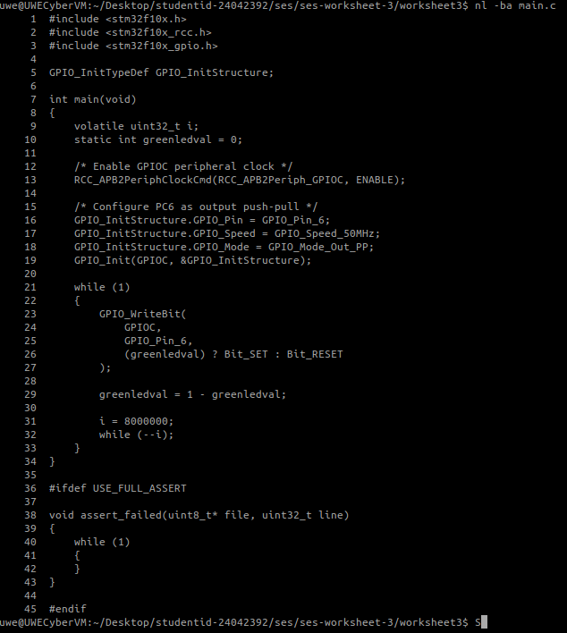
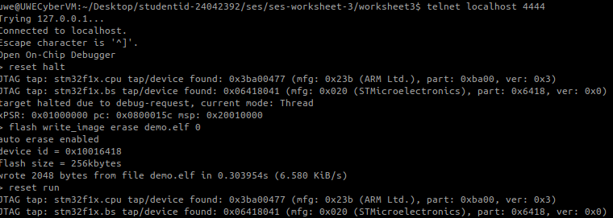
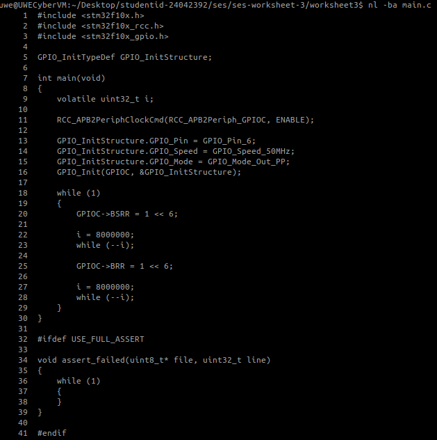
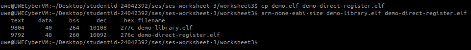
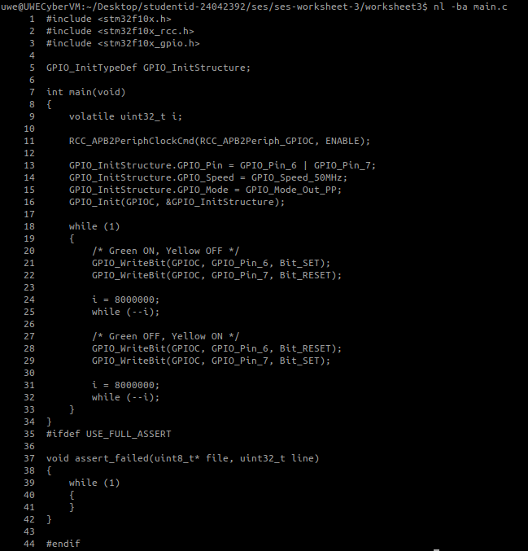
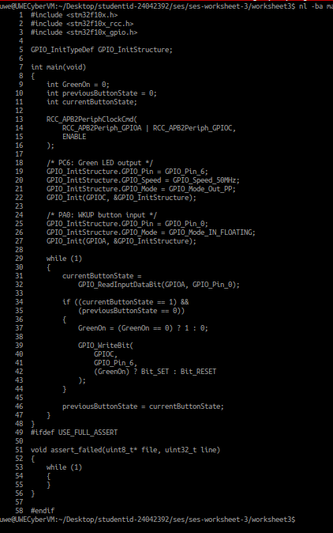
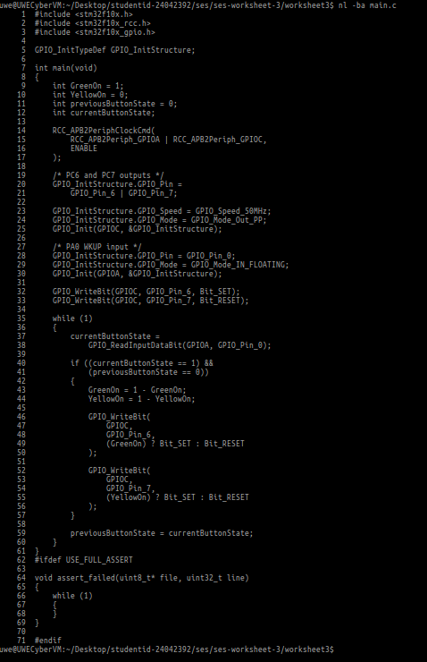
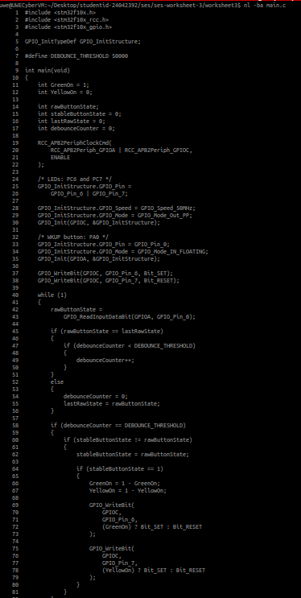

# Secure Embedded Systems – Worksheet 3
## Programming GPIO on the ARM Cortex-M3

**Student ID:** 24042392  
**Module:** Secure Embedded Systems  
**Worksheet:** Worksheet 3 – Programming GPIO on the CM3  

---

## Overview

This repository contains my practical work for **Secure Embedded Systems Worksheet 3**, focused on programming General Purpose Input/Output (GPIO) on an STM32F107 ARM Cortex-M3 microcontroller.

The work undertaken included:

- configuring GPIO pins as outputs;
- flashing the green LED connected to `PC6`;
- replacing `GPIO_WriteBit()` with direct register access using `BSRR` and `BRR`;
- comparing the binary size of the library and direct-register versions;
- alternating the green and yellow LEDs on `PC6` and `PC7`;
- reading the `WKUP` push button connected to `PA0`;
- using the button to toggle the green LED;
- using the button to alternate between the green and yellow LEDs;
- implementing a software debounce mechanism as the credit exercise.

Screenshot and video evidence is included in the `evidence/` directory and linked throughout this README.

---

## Hardware and Software Used

### Hardware

- Olimex STM32-P107 development board.
- STM32F107 ARM Cortex-M3 microcontroller.
- Olimex ARM-USB-TINY-H JTAG debugger/programmer.

### Software and Tools

- Linux virtual machine.
- GNU ARM Embedded Toolchain.
- `arm-none-eabi-gcc`.
- `arm-none-eabi-size`.
- GNU Make.
- OpenOCD.
- Telnet.

---

## Makefile Configuration

To use the STM32 Standard Peripheral Library GPIO and RCC functionality, the following object files were included in the build:

```makefile
OBJS = $(STARTUP) stm32f10x_rcc.o stm32f10x_gpio.o main.o
```

The compiler optimisation level was also changed to:

```makefile
CFLAGS = -O0 -g
```

This was important for the simple software delay loops used in the LED exercises.

---

# Part 1 – GPIO Output

## Pass Exercise 1 – Flashing the Green LED

The first task was to write a program that flashes the green LED continuously.

The green LED is connected to:

```text
PC6
```

The GPIOC peripheral clock was enabled using:

```c
RCC_APB2PeriphClockCmd(RCC_APB2Periph_GPIOC, ENABLE);
```

`PC6` was configured as a 50 MHz push-pull output:

```c
GPIO_InitStructure.GPIO_Pin = GPIO_Pin_6;
GPIO_InitStructure.GPIO_Speed = GPIO_Speed_50MHz;
GPIO_InitStructure.GPIO_Mode = GPIO_Mode_Out_PP;
GPIO_Init(GPIOC, &GPIO_InitStructure);
```

The LED state was changed using:

```c
GPIO_WriteBit(
    GPIOC,
    GPIO_Pin_6,
    (greenledval) ? Bit_SET : Bit_RESET
);
```

The value was toggled using:

```c
greenledval = 1 - greenledval;
```

A software delay was used so that the flashing could be seen by the user.

### Code Evidence



### Build and Flash Evidence

The program was written to the STM32 flash memory through OpenOCD using:

```text
reset halt
flash write_image erase demo.elf 0
reset run
```

The terminal output confirmed that the image was successfully written to the board.



### Video Evidence

[▶ Watch the green LED flashing](evidence/04-green-led-video.mp4)

**Result:** The green LED flashed continuously on the physical STM32 board.

---

## Pass Exercise 2 – Direct Register Access with BSRR and BRR

The next task was to replace the high-level `GPIO_WriteBit()` calls with direct register access.

The LED was turned on using:

```c
GPIOC->BSRR = 1 << 6;
```

The LED was turned off using:

```c
GPIOC->BRR = 1 << 6;
```

### How This Works

`BSRR` is the Bit Set/Reset Register. Writing bit 6 causes the output corresponding to `PC6` to be set.

`BRR` is the Bit Reset Register. Writing bit 6 causes `PC6` to be reset.

The operations:

```c
1 << 6
```

create a value in which only bit 6 is set. Therefore, the program affects only `PC6`.

Direct register access avoids calling the higher-level `GPIO_WriteBit()` function for these output changes.

### Code Evidence



---

## Binary Size Comparison

The library and direct-register versions were compared using:

```bash
arm-none-eabi-size demo-library.elf demo-direct-register.elf
```

The results were:

| Version | text | data | bss | dec | hex |
|---|---:|---:|---:|---:|---:|
| `demo-library.elf` | 9804 | 40 | 264 | 10108 | 277c |
| `demo-direct-register.elf` | 9792 | 40 | 260 | 10092 | 276c |

The direct-register version was:

```text
10108 - 10092 = 16 bytes smaller
```

The size difference is relatively small because the program still uses STM32 library functions for clock configuration and GPIO initialisation. However, replacing `GPIO_WriteBit()` with direct writes to `BSRR` and `BRR` removes some higher-level function overhead.

### Evidence



---

## Pass Exercise 3 – Alternating Green and Yellow LEDs

The third GPIO output exercise required the two LEDs to flash alternately.

The LEDs are connected to:

```text
Green LED  = PC6
Yellow LED = PC7
```

Both pins were configured as outputs:

```c
GPIO_InitStructure.GPIO_Pin = GPIO_Pin_6 | GPIO_Pin_7;
```

The first state was:

```c
GPIO_WriteBit(GPIOC, GPIO_Pin_6, Bit_SET);
GPIO_WriteBit(GPIOC, GPIO_Pin_7, Bit_RESET);
```

This gives:

```text
Green ON
Yellow OFF
```

After the delay, the states were reversed:

```c
GPIO_WriteBit(GPIOC, GPIO_Pin_6, Bit_RESET);
GPIO_WriteBit(GPIOC, GPIO_Pin_7, Bit_SET);
```

This gives:

```text
Green OFF
Yellow ON
```

The process continues indefinitely.

### Code Evidence



### Video Evidence

[▶ Watch the green and yellow LEDs alternate](evidence/08-two-leds-video.mp4)

**Result:** The two LEDs alternated automatically without button input.

---

# Part 2 – GPIO Input

## Input Pass Exercise 1 – WKUP Button Toggles the Green LED

The first input exercise required the `WKUP` button to change the state of the green LED.

The button is connected to:

```text
PA0
```

The green LED is connected to:

```text
PC6
```

The clocks for GPIOA and GPIOC were enabled:

```c
RCC_APB2PeriphClockCmd(
    RCC_APB2Periph_GPIOA | RCC_APB2Periph_GPIOC,
    ENABLE
);
```

`PA0` was configured as a floating input:

```c
GPIO_InitStructure.GPIO_Pin = GPIO_Pin_0;
GPIO_InitStructure.GPIO_Mode = GPIO_Mode_IN_FLOATING;
GPIO_Init(GPIOA, &GPIO_InitStructure);
```

The button was read using:

```c
currentButtonState =
    GPIO_ReadInputDataBit(GPIOA, GPIO_Pin_0);
```

A transition from released to pressed was detected using:

```c
if ((currentButtonState == 1) &&
    (previousButtonState == 0))
```

When this occurred, the green LED state was toggled:

```c
GreenOn = (GreenOn == 0) ? 1 : 0;
```

The intended behaviour was:

```text
Initial state: Green OFF
1st press:     Green ON
2nd press:     Green OFF
3rd press:     Green ON
```

### Code Evidence



### Video Evidence

[▶ Watch the WKUP button toggle the green LED](evidence/10-button-video.mp4)

**Result:** Each detected button press changed the state of the green LED.

---

## Input Pass Exercise 2 – Button Alternates Green and Yellow LEDs

The next input exercise used the same `WKUP` button to alternate between the green and yellow LEDs.

Initial values were:

```c
int GreenOn = 1;
int YellowOn = 0;
```

The initial LED output state was therefore:

```text
Green ON
Yellow OFF
```

When a valid button transition from `0` to `1` was detected:

```c
if ((currentButtonState == 1) &&
    (previousButtonState == 0))
```

both state variables were toggled:

```c
GreenOn = 1 - GreenOn;
YellowOn = 1 - YellowOn;
```

The GPIO outputs were updated using:

```c
GPIO_WriteBit(
    GPIOC,
    GPIO_Pin_6,
    (GreenOn) ? Bit_SET : Bit_RESET
);

GPIO_WriteBit(
    GPIOC,
    GPIO_Pin_7,
    (YellowOn) ? Bit_SET : Bit_RESET
);
```

The expected sequence was:

```text
Initial:   Green ON  | Yellow OFF
1st press: Green OFF | Yellow ON
2nd press: Green ON  | Yellow OFF
3rd press: Green OFF | Yellow ON
```

### Code Evidence



### Video Evidence

[▶ Watch the button alternate between the two LEDs](evidence/12-button-two-leds-video.mp4)

**Result:** Each button press alternated the active LED between green and yellow.

---

# Credit Exercise – Software Debouncing

Mechanical push buttons can produce several rapid electrical transitions when physically pressed or released. This can cause a program to interpret one physical press as multiple presses.

To reduce this problem, I implemented a software debounce mechanism.

The debounce threshold was defined as:

```c
#define DEBOUNCE_THRESHOLD 50000
```

The program uses the following variables:

```c
int rawButtonState;
int stableButtonState = 0;
int lastRawState = 0;
int debounceCounter = 0;
```

The raw button input is read using:

```c
rawButtonState =
    GPIO_ReadInputDataBit(GPIOA, GPIO_Pin_0);
```

If consecutive samples remain the same, the debounce counter increases:

```c
if (rawButtonState == lastRawState)
{
    if (debounceCounter < DEBOUNCE_THRESHOLD)
    {
        debounceCounter++;
    }
}
```

If the raw input changes before reaching the threshold, the counter is reset:

```c
else
{
    debounceCounter = 0;
    lastRawState = rawButtonState;
}
```

The state is only accepted after the input has remained stable long enough:

```c
if (debounceCounter == DEBOUNCE_THRESHOLD)
{
    if (stableButtonState != rawButtonState)
    {
        stableButtonState = rawButtonState;
    }
}
```

The LEDs are toggled only when a stable button press has been confirmed:

```c
if (stableButtonState == 1)
{
    GreenOn = 1 - GreenOn;
    YellowOn = 1 - YellowOn;
}
```

This makes the button handling more robust than the simpler edge-detection implementation used in the previous pass exercises.

### Code Evidence



**Evidence status:** The debounce implementation is supported by code evidence. A separate debounce demonstration video was not included in the supplied evidence set.

---

# Evidence Summary

| Evidence File | Exercise | Description |
|---|---|---|
| `02-green-led-code.png` | Output Pass 1 | Green LED flashing code using `GPIO_WriteBit()`. |
| `03-green-led-build-flash.png` | Output Pass 1 | Successful programming of `demo.elf` to the board. |
| `04-green-led-video.mp4` | Output Pass 1 | Physical demonstration of the green LED flashing. |
| `05-direct-register-code.png` | Output Pass 2 | Direct GPIO control using `BSRR` and `BRR`. |
| `06-size-comparison.png` | Output Pass 2 | Comparison of library and direct-register binary sizes. |
| `07-two-leds-code.png` | Output Pass 3 | Code alternating the green and yellow LEDs. |
| `08-two-leds-video.mp4` | Output Pass 3 | Physical demonstration of automatic LED alternation. |
| `09-button-code.png` | Input Pass 1 | WKUP button toggling the green LED. |
| `10-button-video.mp4` | Input Pass 1 | Physical button-to-green-LED demonstration. |
| `11-button-two-leds-code.png` | Input Pass 2 | Button alternating between green and yellow LEDs. |
| `12-button-two-leds-video.mp4` | Input Pass 2 | Physical demonstration of button-controlled LED alternation. |
| `13-debounce-code.png` | Credit | Software debounce implementation. |

---

# Commands Used

## Build

```bash
make clean
make
```

## Verify Executable

```bash
ls -lh demo.elf
```

## Start OpenOCD

```bash
openocd -f openocd.cfg
```

## Connect to OpenOCD

```bash
telnet localhost 4444
```

## Program and Run the Board

```text
reset halt
flash write_image erase demo.elf 0
reset run
```

## Compare Binary Sizes

```bash
arm-none-eabi-size demo-library.elf demo-direct-register.elf
```

---

# Problems Encountered and Resolved

## 1. Missing Peripheral Library Objects

When GPIO and RCC functions were first used, the linker required the relevant object files.

The Makefile was updated to include:

```makefile
stm32f10x_rcc.o
stm32f10x_gpio.o
```

This allowed functions such as:

```c
RCC_APB2PeriphClockCmd()
GPIO_Init()
GPIO_WriteBit()
GPIO_ReadInputDataBit()
```

to be linked successfully.

## 2. Undefined Reference to `assert_failed`

The project was compiled with:

```text
-DUSE_FULL_ASSERT
```

This caused the STM32 Standard Peripheral Library to expect an `assert_failed()` function.

The following handler was added:

```c
#ifdef USE_FULL_ASSERT

void assert_failed(uint8_t* file, uint32_t line)
{
    while (1)
    {
    }
}

#endif
```

This resolved the linker error.

## 3. Correct Worksheet Directory

At one point, Worksheet 3 code was compiled from the Worksheet 2 directory. This resulted in missing GPIO and RCC library references.

The work was then correctly compiled from:

```text
ses-worksheet-3/worksheet3
```

with the updated Worksheet 3 Makefile.

---

# Completion Status

## GPIO Output Exercises

- [x] Pass Exercise 1 – Flash the green LED in an infinite loop.
- [x] Pass Exercise 2 – Replace `GPIO_WriteBit()` with direct `BSRR` and `BRR` access.
- [x] Compare the library and direct-register binary sizes.
- [x] Pass Exercise 3 – Alternate the green and yellow LEDs.

## GPIO Input Exercises

- [x] Input Pass Exercise 1 – Use the WKUP button to toggle the green LED.
- [x] Input Pass Exercise 2 – Use the button to alternate between the green and yellow LEDs.

## Credit Exercise

- [x] Implement software debounce logic.
- [ ] Separate debounce demonstration video not included in the supplied evidence.

---

# Repository Structure

```text
ses-worksheet-3/
├── README.md
└── evidence/
    ├── 02-green-led-code.png
    ├── 03-green-led-build-flash.png
    ├── 04-green-led-video.mp4
    ├── 05-direct-register-code.png
    ├── 06-size-comparison.png
    ├── 07-two-leds-code.png
    ├── 08-two-leds-video.mp4
    ├── 09-button-code.png
    ├── 10-button-video.mp4
    ├── 11-button-two-leds-code.png
    ├── 12-button-two-leds-video.mp4
    └── 13-debounce-code.png
```

---

# Final Result

The Worksheet 3 practical work successfully demonstrated GPIO output and input programming on the STM32F107 ARM Cortex-M3 microcontroller.

The completed work includes:

- configuring GPIO outputs;
- controlling the green and yellow LEDs;
- comparing library-based and direct-register GPIO access;
- programming the board through OpenOCD;
- reading physical push-button input;
- toggling outputs in response to user interaction;
- implementing software debouncing.

The submitted screenshots and videos provide evidence of the code, compilation/programming process and physical hardware behaviour for the completed exercises.
