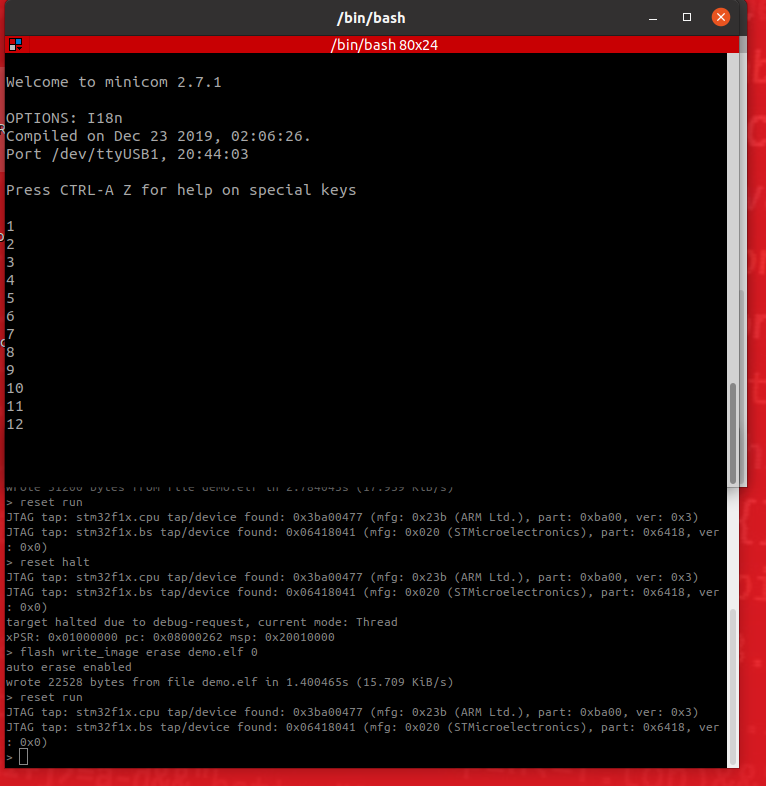
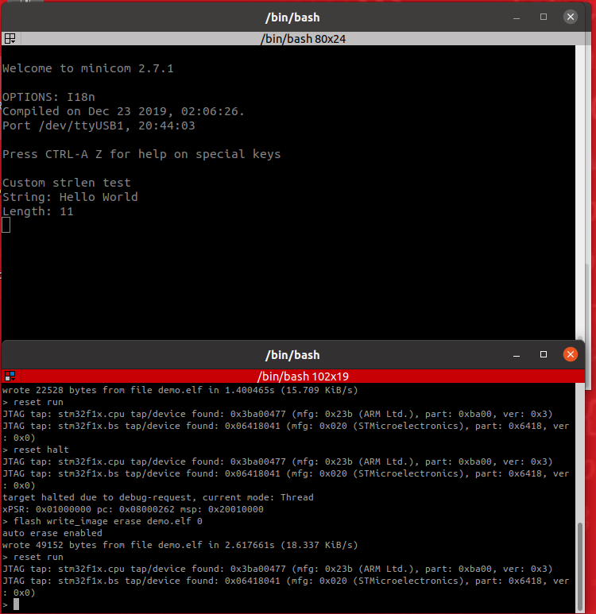
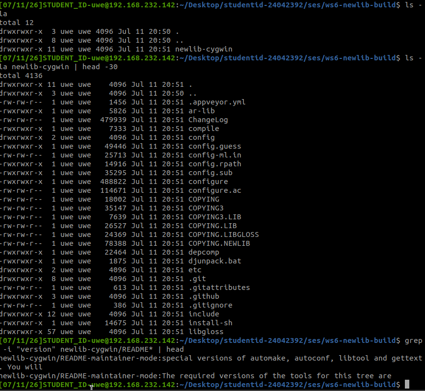
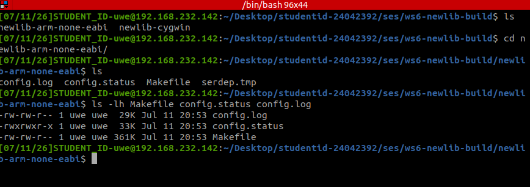
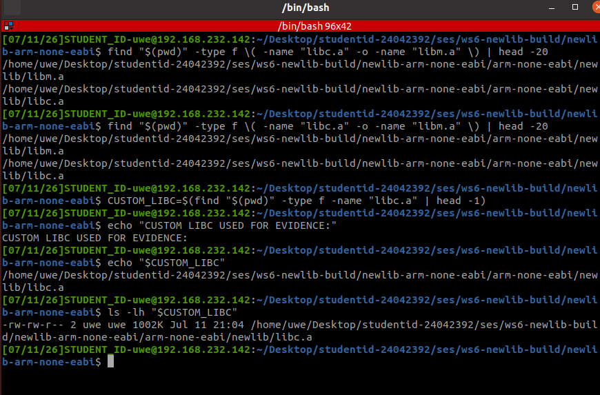
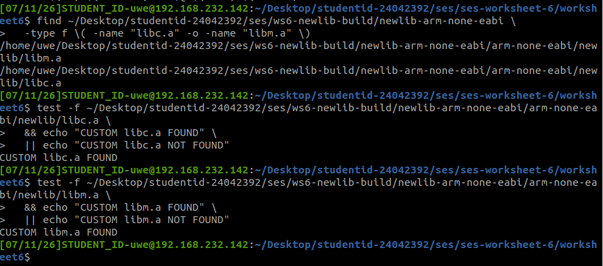
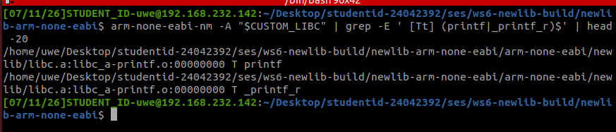
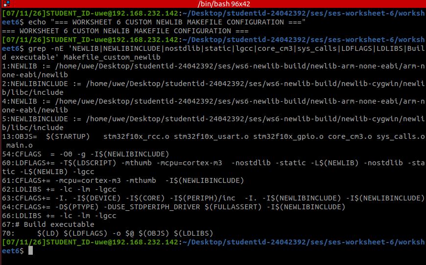

# SeS Worksheet 6 — Building a Library

**Student ID:** 24042392  
**Platform:** STM32 Olimex STM32-P107 / STM32F10x Cortex-M3  
**Toolchain:** `arm-none-eabi-gcc` 9.2.1  
**Debugging/Flashing:** OpenOCD + Telnet  
**Serial terminal:** Minicom at 9600 baud  

---

## 1. Introduction

This worksheet develops the transition from basic character-based input/output on an embedded STM32 system to the use of a standard C library, specifically **newlib**, together with the system-call support needed by functions such as `printf()` and `getchar()`.

The work was completed in the same logical order as the worksheet:

1. Understand the limitation of outputting raw character values.
2. Convert the numbers 1 to 12 into ASCII output.
3. Implement a custom string-length function.
4. Obtain the newlib source code.
5. Configure and build newlib for `arm-none-eabi`.
6. Confirm that the resulting custom library archives were created.
7. Integrate the required system calls and custom newlib paths into the application build.
8. Complete Pass Exercise 1 using `printf()` over UART.
9. Complete Pass Exercise 2 using `_read()`, `__io_getchar()` and `getchar()`.

The two credit exercises were optional and were not attempted.

---

## 2. Initial Project Build and Baseline Test

Before changing the application, the existing Worksheet 6 project was built successfully.

Typical commands used were:

```bash
make clean
make
ls -lh demo.elf
arm-none-eabi-size demo.elf
```

The original build produced a valid `demo.elf` image and confirmed that the project, compiler and linker were operational before the library work began.

**Evidence:**

.png)

The initial UART program was then flashed with OpenOCD and executed on the STM32 board. Minicom showed repeated `hello` output, confirming that UART transmission and the flashing process were working correctly.

**Evidence:**

.png)

---

## 3. Preliminary Exercise 1 — Output the Numbers 1 to 12 as ASCII

The worksheet first demonstrates that calling `putchar(i)` with an integer value does not automatically display that value as readable decimal text. The integer must be converted into its ASCII digit representation.

A separate source file was used for this test so that the final working Worksheet 6 program was preserved. The program iterated from 1 to 12 and converted each integer into one or more ASCII digits before transmitting them over USART2.

Conceptually, the solution followed this structure:

```c
for (i = 1; i <= 12; i++)
{
    uart_print_uint(i);
    __io_putchar('\r');
    __io_putchar('\n');
}
```

The UART output showed:

```text
1
2
3
4
5
6
7
8
9
10
11
12
```

This proves that values greater than 9 were correctly converted into multiple ASCII characters rather than sent as raw numeric byte values.

**Evidence:**



---

## 4. Preliminary Exercise 2 — Custom `strlen()`

The second preliminary exercise required a custom implementation of a string-length function.

A separate test program implemented the following logic:

```c
int my_strlen(const char *s)
{
    int length = 0;

    while (*s != '\0')
    {
        length++;
        s++;
    }

    return length;
}
```

The test string was:

```text
Hello World
```

The program correctly calculated its length as 11 characters.

**Evidence:**



---

## 5. Obtaining the newlib Source Code

The worksheet next introduces **newlib**, a C standard library designed for embedded systems and other environments where there may be no full operating system.

A separate workspace was created so that the original Worksheet 6 application files were not affected:

```bash
cd ~/Desktop/studentid-24042392/ses
mkdir -p ws6-newlib-build
cd ws6-newlib-build
```

The newlib source tree was then obtained from the Sourceware repository:

```bash
git clone git://sourceware.org/git/newlib-cygwin.git
```

The downloaded source directory contained the expected project structure, including the `newlib`, `libgloss`, configuration and build files.

**Evidence:**



---

## 6. Configuring newlib for ARM Cortex-M3

A separate out-of-tree build directory was created:

```bash
mkdir newlib-arm-none-eabi
cd newlib-arm-none-eabi
```

newlib was configured for the bare-metal ARM target using:

```bash
../newlib-cygwin/configure \
  --target=arm-none-eabi \
  --disable-newlib-supplied-syscalls \
  --srcdir=../newlib-cygwin \
  --prefix="$(pwd)" \
  --with-gnu-as \
  --with-gnu-ld \
  --enable-multilib=no
```

The important configuration choice is:

```text
--disable-newlib-supplied-syscalls
```

The STM32 application is a bare-metal embedded program, so there is no operating system to provide normal file, terminal, process or memory system calls. The application therefore supplies its own implementations of functions such as `_write()`, `_read()` and `_sbrk()`.

Successful configuration produced files such as:

```text
Makefile
config.status
config.log
```

**Evidence:**



---

## 7. Building newlib and Verifying the Resulting Libraries

The custom newlib build was compiled for Cortex-M3 using target-specific compiler options.

The build produced the standard C and mathematics libraries:

```text
libc.a
libm.a
```

The resulting files were verified directly with commands equivalent to:

```bash
find "$(pwd)" -type f \( -name "libc.a" -o -name "libm.a" \) | head -20
```

The result confirmed that the custom build directory contained both library archives.

**Evidence:**



The same result was also checked explicitly with file tests:

```text
CUSTOM libc.a FOUND
CUSTOM libm.a FOUND
```

**Evidence:**



To further confirm that the custom `libc.a` archive contained the required formatted-output implementation, the archive symbol table was inspected with `arm-none-eabi-nm`.

The result showed `printf`-related symbols, including `_printf_r`, inside the custom `libc.a` archive.

**Evidence:**



---

## 8. Integrating the Custom newlib Build into the Application Makefile

A separate Makefile was used for custom-newlib integration so that the original working build configuration remained preserved.

The Makefile was configured with the custom newlib source and build paths:

```makefile
NEWLIB := /home/uwe/Desktop/studentid-24042392/ses/ws6-newlib-build/newlib-arm-none-eabi/arm-none-eabi/newlib
NEWLIBINCLUDE := /home/uwe/Desktop/studentid-24042392/ses/ws6-newlib-build/newlib-cygwin/newlib/libc/include
```

The object list included the files required by the worksheet:

```makefile
core_cm3.o
sys_calls.o
main.o
```

The compiler and linker configuration included the custom newlib headers and libraries:

```makefile
-I$(NEWLIBINCLUDE)
-nostdlib
-static
-L$(NEWLIB)
-lc
-lm
-lgcc
```

This demonstrates that the application build was explicitly configured to use the custom newlib build directory rather than relying only on the system-installed toolchain library.

**Evidence:**



---

## 9. System-Call Support for newlib

newlib requires low-level system-call functions so that higher-level C library functions can communicate with the hardware.

The application used a `sys_calls.c` file containing the required support code. Two especially important functions were `_write()` and `_read()`.

### 9.1 `_write()` and standard output

`printf()` ultimately writes data through `_write()`. The implementation sends each character to USART2 through `__io_putchar()`.

Conceptually:

```c
int _write(int file, char *ptr, int len)
{
    int n;

    switch (file)
    {
        case STDOUT_FILENO:
        case STDERR_FILENO:
            for (n = 0; n < len; n++)
            {
                __io_putchar(*ptr++ & (u16)0x01FF);
            }
            break;

        default:
            errno = EBADF;
            return -1;
    }

    return len;
}
```

The output path is therefore:

```text
printf()
   ↓
newlib libc
   ↓
_write()
   ↓
__io_putchar()
   ↓
USART2
   ↓
Minicom
```

### 9.2 `_sbrk()` and CMSIS support

The supplied system-call code also uses `_sbrk()` for heap management. This required CMSIS support through `core_cm3.o` because the implementation uses `__get_MSP()` when checking memory boundaries.

The final object list therefore included both:

```text
sys_calls.o
core_cm3.o
```

---

## 10. Pass Exercise 1 — `printf()` over UART

The first formal pass exercise required a new `main.c`, based on the earlier UART work, which initialised the COM port and called `printf()` repeatedly.

The final source used:

```c
#include <stdio.h>
```

and:

```c
int main(void)
{
    COMPortInit();

    while (1)
    {
        printf("Worksheet 6 printf test - Student 24042392\r\n");
    }
}
```

This is functionally equivalent to the worksheet's suggested repeated `printf("hello world\n");` test, while also identifying the student and worksheet in the runtime output.

**Source evidence:**

.png)

The program compiled successfully and produced a larger ELF image because formatted I/O from the C library was now linked into the application.

**Build evidence:**

.png)

The application was flashed and executed successfully. Minicom displayed repeated lines of:

```text
Worksheet 6 printf test - Student 24042392
```

**Runtime evidence:**

.png)

This completes Pass Exercise 1.

---

## 11. Pass Exercise 2 — Standard Input with `_read()` and `__io_getchar()`

The second formal pass exercise required implementing the read system call using the UART input function developed previously.

### 11.1 `__io_getchar()`

The low-level UART input function waits until USART2 has received a byte:

```c
int __io_getchar(void)
{
    while (USART_GetFlagStatus(USART2, USART_FLAG_RXNE) == RESET)
    {
    }

    return (int)(USART_ReceiveData(USART2) & 0xFF);
}
```

The test application then used standard C input:

```c
c = getchar();
```

**Source evidence:**

.png)

### 11.2 `_read()` implementation

The original `_read()` stub returned an error. It was replaced with a working implementation that accepts `STDIN_FILENO`, receives one character through `__io_getchar()`, stores it in the caller's buffer, and returns the number of bytes read:

```c
int _read(int file, char *ptr, int len)
{
    if (file != STDIN_FILENO)
    {
        errno = EBADF;
        return -1;
    }

    if (len <= 0)
    {
        return 0;
    }

    *ptr = (char)__io_getchar();

    return 1;
}
```

**Source evidence:**

.png)

The complete input path is therefore:

```text
Keyboard input in Minicom
        ↓
USART2 RX
        ↓
__io_getchar()
        ↓
_read()
        ↓
newlib getchar()
        ↓
main()
```

### 11.3 Runtime test

The program prompted for characters and displayed each received character together with its ASCII value.

The test input was:

```text
tiago
```

The observed values were:

```text
Received: 't' (ASCII 116)
Received: 'i' (ASCII 105)
Received: 'a' (ASCII 97)
Received: 'g' (ASCII 103)
Received: 'o' (ASCII 111)
```

The same evidence also shows the firmware being flashed and executed through OpenOCD/Telnet.

**Runtime evidence:**

.png)

This completes Pass Exercise 2.

---

## 12. Troubleshooting and Problem Solving

Several problems were encountered and resolved during the worksheet.

### 12.1 `printf()` initially failed to link

When `printf()` was first introduced, the project did not link correctly because `sys_calls.o` was not included in the final object list.

The solution was to include:

```text
sys_calls.o
```

This supplied the `_write()` implementation required by newlib output functions.

### 12.2 Undefined reference to `__get_MSP`

After adding `sys_calls.o`, the linker reported an undefined reference to:

```text
__get_MSP
```

The `_sbrk()` implementation relies on CMSIS functionality for checking the main stack pointer, so `core_cm3.o` was added to the object list.

The final relevant object configuration included:

```text
core_cm3.o
sys_calls.o
main.o
```

### 12.3 Undefined reference to `__io_getchar`

When using the working `_read()` implementation with temporary preliminary test programs, the linker required an implementation of `__io_getchar()` because `_read()` referenced it.

The temporary test programs therefore included the same UART receive function used in the final Pass Exercise 2 solution.

### 12.4 `assert_failed` linker error

The project was compiled with:

```text
-DUSE_FULL_ASSERT
```

Temporary standalone test programs initially did not define `assert_failed()`, which caused linker errors. A minimal implementation was added to the temporary files used for the ASCII and custom `strlen()` tests.

### 12.5 Serial port enumeration changed

During testing, the USB serial device assignment changed.

At one point:

```text
/dev/ttyUSB0
```

was the UART interface. Later, the FTDI JTAG interface occupied `ttyUSB0` and the CH341 USB-to-serial adapter became:

```text
/dev/ttyUSB1
```

The final input tests therefore used:

```bash
sudo minicom -o -D /dev/ttyUSB1 -b 9600 -8
```

This explains why an apparently correct input program initially appeared not to receive characters.

### 12.6 newlib build failed because `makeinfo` was missing

The first custom newlib build attempt stopped with:

```text
makeinfo: not found
```

The missing dependency was supplied by the `texinfo` package. After installing it, the newlib build directory was recreated and the project was configured and built again.

This produced the expected custom `libc.a` and `libm.a` archives.

---

## 13. Requirement-to-Evidence Summary

| Worksheet requirement | Evidence | Status |
|---|---|---|
| Output numbers 1–12 as ASCII | `23_ws6_ascii_1_to_12_uart_output.png` | Complete |
| Implement custom string length function | `26_ws6_custom_strlen_uart_output.png` | Complete |
| Obtain newlib source | `27_ws6_newlib_source_downloaded.png` | Complete |
| Configure newlib for `arm-none-eabi` | `29_ws6_newlib_successful_configuration.png` | Complete |
| Build newlib | `34_ws6_custom_newlib_libraries_exist.png` | Complete |
| Verify `libc.a` and `libm.a` | `34_ws6_custom_newlib_libraries_found.png` | Complete |
| Verify custom `libc.a` contains `printf` | `35_ws6_custom_libc_contains_printf.png` | Complete |
| Configure application Makefile for custom newlib | `36_ws6_custom_newlib_makefile_configuration.png` | Complete |
| Include `core_cm3.o` and `sys_calls.o` | Makefile configuration and source/build evidence | Complete |
| Pass Exercise 1: use `printf()` | Source, build and runtime evidence | Complete |
| Pass Exercise 2: implement `_read()` using `__io_getchar()` | Source and runtime evidence | Complete |
| Credit Exercise 1: random maths quiz | Not attempted | Optional |
| Credit Exercise 2: print data, stack and heap values | Not attempted | Optional |

---

## 14. Evidence Index

The following screenshots are referenced by this README and should be stored in the `evidence/` directory:

```text
02_ws6_successful_build_and_size(4).png
05_ws6_program_prompt_after_flash(3).png
08_ws6_printf_source_code(3).png
09_ws6_printf_successful_build(3).png
11_ws6_printf_uart_output(3).png
13_ws6_getchar_and_read_source_code(3).png
13_ws6_getchar_and_read_source_codep2(4).png
19_ws6_getchar_ascii_input_output(2).png
23_ws6_ascii_1_to_12_uart_output.png
26_ws6_custom_strlen_uart_output.png
27_ws6_newlib_source_downloaded.png
29_ws6_newlib_successful_configuration.png
34_ws6_custom_newlib_libraries_exist.png
34_ws6_custom_newlib_libraries_found.png
35_ws6_custom_libc_contains_printf.png
36_ws6_custom_newlib_makefile_configuration.png
```

---

## 15. Conclusion

Worksheet 6 was completed by first solving the low-level character and string exercises, then progressing to the larger problem of providing standard C library functionality on a bare-metal STM32 system.

The custom newlib source was obtained, configured for `arm-none-eabi`, built successfully, and verified through the presence of `libc.a` and `libm.a`. The custom `libc.a` archive was also inspected and shown to contain `printf`-related symbols. The application Makefile was then configured with the custom newlib include and library paths and the required linker flags.

At application level, `printf()` was successfully routed through newlib, `_write()`, `__io_putchar()` and USART2. Standard input was then implemented through `getchar()`, `_read()` and `__io_getchar()`, with received characters displayed together with their ASCII values.

The two required pass exercises were therefore completed successfully. The optional credit exercises were not attempted.
